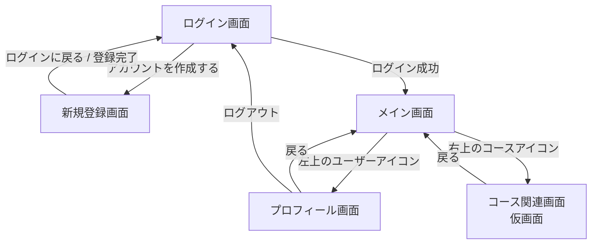
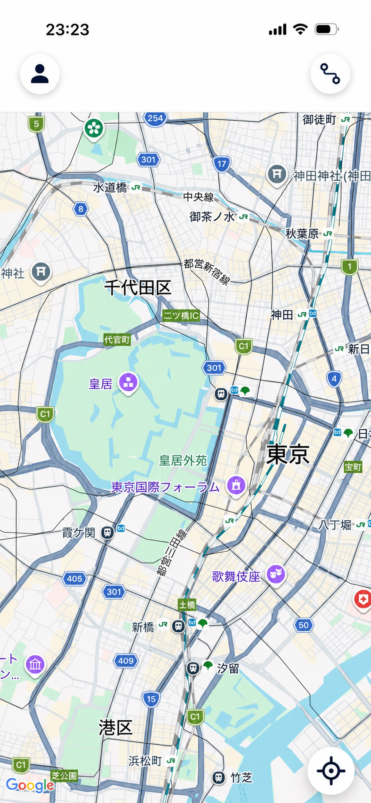
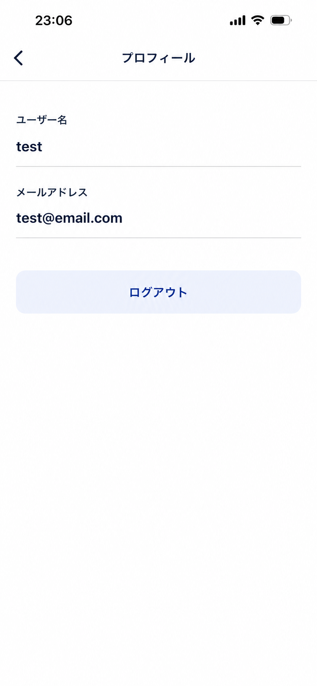

# ナビゲーション基盤 画面仕様書

## 目的

現在のログイン後画面は、地図表示とユーザー情報表示が 1 画面にまとまっている。
今後プロフィール画面やコース関連画面を追加しやすくするため、メイン画面から各機能画面へ移動できる構成に変更する。

本仕様では、Issue #4 で新たに変更・追加する画面を中心に、ユーザーから見える完成形と操作時の動きを整理する。

## 画面遷移

## 1. メイン画面

### 完成イメージ

### 変更内容

- これまで画面上部に表示していたユーザー名、メールアドレス、ログアウトボタンは表示しない
- 左上に、プロフィール画面へ移動するためのユーザーアイコンボタンを追加する
- 右上に、コース関連画面へ移動するためのコースアイコンボタンを追加する
- 地図、現在地マーカー、右下の現在地ボタンはこれまで通り表示する

### ボタンの動作

| ボタン | 動作 |
| --- | --- |
| 左上のユーザーアイコン | プロフィール画面へ移動する |
| 右上のコースアイコン | コース関連画面へ移動する |
| 右下の現在地ボタン | 現在地へ地図を移動する |

## 2. プロフィール画面

### 完成イメージ

### 表示するもの

- 画面タイトル「プロフィール」
- ユーザー名
- メールアドレス
- ログアウトボタン
- 前の画面へ戻る操作

### 動作

| 操作 | 動作 |
| --- | --- |
| 戻る | メイン画面へ戻る |
| ログアウト | ログイン画面へ移動する |

### 補足

- ログアウト後は、戻る操作でメイン画面やプロフィール画面へ戻れない
- Issue #4 の段階では、プロフィール情報の編集機能は持たせない

## 3. コース関連画面

### 完成イメージ

### 画面の位置づけ

将来のコース機能へ進むための入口として用意する画面。
Issue #4 の段階では、本格的な機能は持たせず、画面遷移ができることを確認できる仮画面とする。

### 表示するもの

- 画面タイトル「コース」
- 仮画面であることが分かる簡単な文言
- 前の画面へ戻る操作

### 動作

| 操作 | 動作 |
| --- | --- |
| メイン画面右上のコースアイコン | コース関連画面へ移動する |
| 戻る | メイン画面へ戻る |

## Issue #4 で実現すること

- メイン画面から別画面へ移動できるようにする
- 左上のユーザーアイコンからプロフィール画面へ移動できるようにする
- 右上のコースアイコンからコース関連画面へ移動できるようにする
- ユーザー名とメールアドレスの表示をプロフィール画面へ移す
- ログアウト操作をプロフィール画面へ移す
- ログアウト後はログイン画面へ戻り、認証後の画面へ戻れないようにする

## Issue #4 では扱わないこと

- プロフィール情報の編集
- コース一覧の表示
- コース作成や保存
- コース検索
- コース機能の詳細設計
